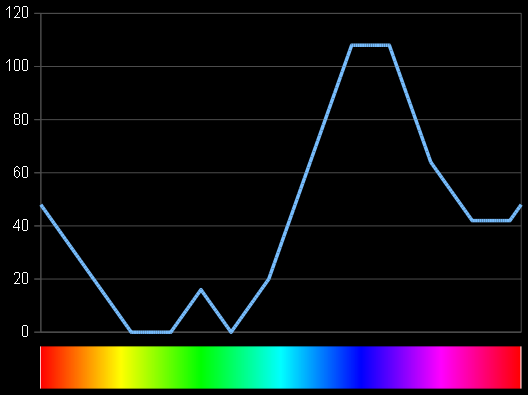

# Byte oriented HSL to RGB conversion

Integer converter with byte input and output
--------------------------------------------

Today's display monitors use RGB color model, and this determines that programmer select this notation as obvious for _storing_ color constants.

In order of trying to make applications's colors more precise, flexible, easier to define when more than just few colors are need, and due to eye health care reasons like high contrast modes; or, when not just storage, but processing or generating of colors is required; -- one earlier or later notices that RGB is fairly inconsistent for that, so it's time to next level of understanding, HSL (or HSV) color model.

It is essentially more convenient and predictable for color operations, like make it brighter or darker, or even invert luma (brightness) without color damage, so red stays red, not aqua as per RGB inversion. If you need a bunch of colors for your diagram, then the answer will be like `HSL(N, 192, 64)` for paper and `(N, 192, 192)` for screen; how will you do it with RGB? Same if you need say day-of-week-dependent accents for your web page.

Current display monitors can't operate with HSL color model yet. So, conversion is need.
Let's look at bare HSL (without correction, as seen below). It have the property that it keeps full dynamic range, and thus color itself, during RGB->HSL->RGB conversion.

Sadly, these conversions are quite not simple nor obvious. There are many forms of these, more or less precise or fast. But none byte-oriented one I found so far. Most known converters uses either (360, 101, 101) integer range, or (1.0, 1.0, 1.0) float range, while byte-range like (256, 256, 256) integer range are most demanded, due to constants define, storage, and processing. It is not a big secret that say (1.0, 1.0, 1.0) float range can be easily recalculated as byte range, and most time it's done like that. But when we want higher efficiency, known converters should be re-thinked as integer math with byte-range both input and output. Bytes are guarantees that there is no over/undershoot possible, makes them a requirement for hi-rel apps.

The problem with integer math is it way harder than floats. Here I am try to see if it will work, and how fast and precise it is.

I will use this reference code [^1]; this one, as well as any other you may find, include for 8-bit slow microcontrollers (_sic!_), are **uses float math**. This time I will try only one way, HSL->RGB. This solves most of tasks; not solved ones are include luma inversion of images (icons). TODO.

I provide C code here for research of precision and speed.

Current research results are show that there are two adequate solutions were made. One is high precision, and another one is somewhat faster. Please see `hsl2rgb` and `hsl2rgb_fast` at C code.

High precision one gives error no more than 1 for RGB values, compared to reference.
Faster one gives error of no more than 3, and about a tenth faster than precision one: `0.61 s` vs `0.67 s` per 100M calls using old core i3 CPU. While reference float math takes `~1.1 s` for that.

> These values are for **`-O2`** `gcc` or `clang` option. Using `-O3` may meet this issue[^3].

One may note that error of 3 is highly negligible, as it starts to occur from 1/3 of brightness (here error will be 1), which is far not same as this error near zero brightness, at today's gamma correction curve (near linear) of modern display units. Btw, one may also note that w3c online checker [^2] is also differs from reference.

Example: (here is the first brightness-sorted value with error of 1 occurs)

    a.out 00f42e

says

    HSL 00f42e, w3c hsl(0, 95%, 18%),  ref RGB 5a0101,  my RGB 590202, my RGBfast 590302

while use [^2] tool shows for _hsl(0, 95%, 18%)_

    #5A0202

Note that precision of w3c color model itself is low, due to it uses range of only `101` for `S` & `L`.

Both my `hsl2rgb` and `hsl2rgb_fast` are perfect candidates to be implemented with hardware, at display scaler IC, for future HSL display monitors. HSL on display cable is not have any disadvantage. Ask me if one need a 10-bit version for that.

I hope the C code i provide, is self-explaining as much as possible, and can be useful. Please let me know if it can be made faster or better.

Equibright correction
---------------------

While regular (full range) HSL works well, one may note earlier or later that, using it for color sets generation, yellow color looks way brighter than blue. This is not due to conversion bug or HSL model itself, as its purpose is to correctly remix color channels from/to RGB, and it does it well. Rather, we fall here into **perceptual brightness** trouble. It is evil enough, as it not only does not have more or less settled solution, but also highly dependent on display monitor type and epoch, and personal taste. Good news are, here HSL also plays its best, as for it, correction expected to be doable and fast enough, while, for RGB, can be a pain (tip: think about white balance).

Note that any correction will limit dynamic range of display unit used, as well as, does it non reversible any more, as it will eat dynamic range; i.e., complementary RGB->HSL (TODO) exist only for plain (full range) HSL. 

Full correction requires quite bright display, as only tenth (pure yellow to pure blue perceptual brightness ratio) will then be used for regular pictures.

At other side, we can try correct luminance, which may allow to use regular existing display monitors. Obviously, increase luminance say for pure blue (i.e. already 100% display's power spent for blue pixel) is impossible without some color damage.

Of course, equibright should not be used for anything other than color sets generation (by its definition). So most time the latter approach looks useful. Let's try to set up some hue-dependent correction curve:

    MAX(48-MIN(hue,255-hue),0) + MAX(16-abs(hue-85),0) + MAX(64-abs(hue-165),0) + MAX(64-abs(hue-185),0); /* Input is hue, 0..255 */

which gives us

As this correction is for fully saturated (pure) colors, some linear decompensation should be added for less than full saturation.

Results show way better colors and color sets generation, so it will be used in my Carla patches, Jasmine-SA, and [Simple.c window decorator](https://github.com/twonoise/simple.c/blob/37f1ee8aa3aa5a6da2e30f39afde004e2261284f/simple.c#L216). The latter have adjustable correction. Please use it as real use example.

Note that, as equibright is only for color generation, the speed is no any importance, unlike of regular HSL->RGB above. But still i approximate the curve with integer linear math, so i expect it be fast enough. Or, look-up lable, created with Bezier line, may give better speed and "precision".

2nd note is, unlike regular or full-range HSL, with our perceprually luma-corrected one (sometimes called **HSP**), there is impossible to generate most _pure_ colors like yellow or blue (also, by its definition).

Note also the current curve itself still far from ideal, if this "ideal" possible ever, as it is highly varies with display device technology, like, OLEDs are have much powerful blue channel. You may tune it up for your display.

[^1]: https://axonflux.com/handy-rgb-to-hsl-and-rgb-to-hsv-color-model-c
[^2]: https://www.w3schools.com/tools/tool_color_converter.php
[^3]: https://gist.github.com/twonoise/940c979ad3d0d9fc59fdefa5edd82a08
